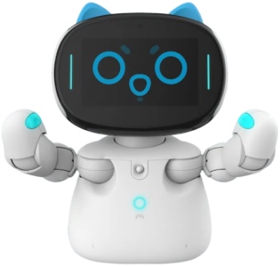
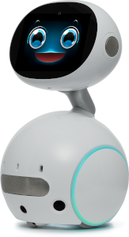
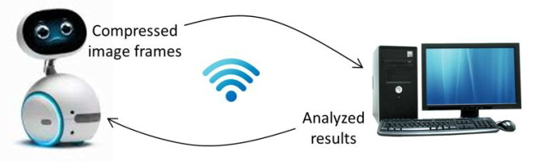

#### Introduction
This project aims to develop an interactive desktop multimedia robot system to alleviate the shortage of nurse educators in Taiwanese hospitals. We set our initial goal to deliver pre- and post-surgical health education to cataract patients. 

#### Progress
YouTube video:

#### Robot Models
For the desktop uage, robots in a small size are proper. We use Kebbi Air-S and Zenbo Junior II in our project.

|Model| Kebbi Air-S | Zenbo Junior II |
|:----| :----: | :----: |
|image|  |  |
|OS   | Android 9 | Android 10 |
|height | 31.8 cm | 31.8 cm |
|weigh | 2.5 kg | 2.75 kg |
|Manufactor | NuwaRobotics| Asus|

#### Goal
The robot can talk with the patients smoothly, help the pateint to make a proper decision about his/her artificial lenses, and guide the patient to remember important informaiton regarding the surgery.

#### Technical Components

Because those small social robots' computational power is limited, we adopt a client-server architure to left the heavy-duty jobs such computer vision and natural language processing on the server. The robot only take the role as a friendly and intuitive human-computer user interface. The robot will see, speak, and act, but visual and voice data are all sent to the server to process. The robot only passively receive the commands from the serve to do actions.