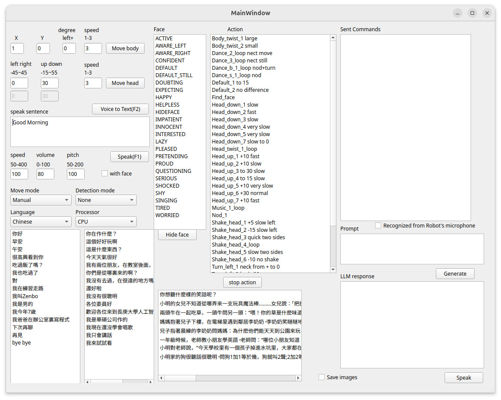

This folder contains the code files for the server side program of RobotNurseHelper. It provides an Graphic User Interface (GUI) for a user to remotely control the robot's action. The GUI currently looks like the image below and allows a user to send commands to the robot-side's app, which calls Zenbo SDK or Kebbi SDK to execute those commands.



# Install
We create a script file to install our code and all required libraries MediaPipe, OpenCV, git, gcc, Protocol Buffer, Qt, and PortAudio.
The easiest way to install our program is to execute the following script.
```sh
cd ~
wget -O install.sh https://raw.githubusercontent.com/yangchihyuan/RobotNurseHelper/refs/heads/master/Server/install.sh
chmod +x install.sh
./install.sh
echo "Don't use sudo ./install.sh. That is wrong."
```

It will ask for your sudo password several times, because the sudo password will expire atfer 15 minutes, but the process of installation take more than 1 hour to download and compile all required libraries.

Roughly 50Gib data will be downloaded from the Internet if your Ubuntu 24.04 is just installed without any required libraries. Thus, we recommand run the install script with a high-speed Internet connection. When everything is ready, you can use the following command to launch our program.

Our server-side program requires a GPU to run Whisper.cpp and AnythingLLM rapidly. If your PC does not have a NVidia GPU, our program still can run, but very slowly, and you can not get response immediately. Because both Whisper.cpp and AnythingLLM have multiple models in different size. We recommand you have 8G VRAM to load the Whisper's ggml-large-v3-turbo model and Gemma3:1b model.

# Setting file
Every machine will have its own configuation such as AnythingLLM API key. You need to edit your own setting in a JSON file. There is an example to run the program if your setting file is ready.

```sh
./run_server_side_program.sh json/Setting.json
```

# Known problems and workarounds
You cannot install the pre-built OpenCV and Protocol Buffer packages for Ubuntu 24.04. The pre-built OpenCV 4.6.0 conflicts with MediaPipe's dependent OpenCV version in terms of their included Protocol Buffer version.
